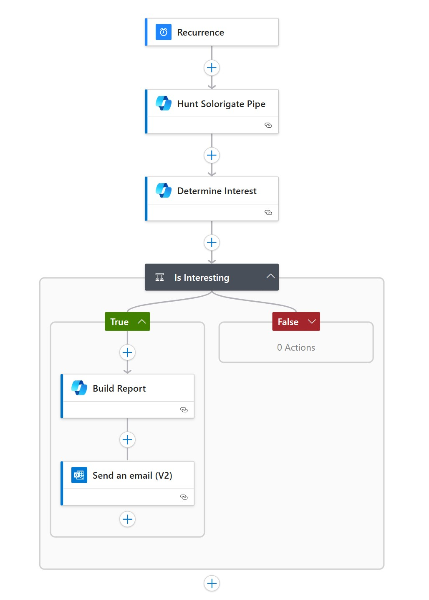

# AiHunt Logic App

This Logic App automates weekly hunting for **Solorigate pipe activity** using Microsoft Security Copilot and delivers summarized findings by email.

---

## 📌 Overview

The workflow is designed to:
1. Run on a weekly schedule.
2. Trigger a hunting query against Security Copilot for Solorigate pipe detection.
3. Evaluate whether the results are *interesting*.
4. If relevant, build a concise HTML report.
5. Send the report by email to a configured recipient.

This enables continuous automated hunting with **AI-driven triage** and **actionable reporting**.

---

## 🔄 Workflow Diagram



---

## ⚙️ Workflow Steps

1. **Recurrence Trigger**  
   Runs every week (configurable in the Logic App definition).

2. **Hunt Solorigate Pipe**  
   Calls Security Copilot with the plugin `AgentHuntSolorigatePipeDetection` to search for Solorigate-related indicators.

3. **Determine Interest**  
   Uses Copilot reasoning (`/askgpt`) to classify findings.  
   - Responds **"yes"** if interesting.  
   - Responds **"no"** if not.

4. **Is Interesting (Condition)**  
   - If **No** → The workflow ends.  
   - If **Yes** → Proceeds to reporting.

5. **Build Report**  
   Generates an **HTML summary** of the findings for email delivery.

6. **Send an Email**  
   Sends the weekly hunting report to the configured `notificationEmail` recipient via Office 365.

---

## 📑 Parameters

| Parameter                        | Description                                     | Default |
|----------------------------------|-------------------------------------------------|---------|
| **workflowName**                  | Name of the Logic App                          | `AiHunt` |
| **location**                      | Deployment location (defaults to RG location)  | - |
| **notificationEmail**             | Email address where reports are sent           | *Required* |
| **securityCopilotConnectionName** | Connection name for Security Copilot API       | `securitycopilot-conn` |
| **office365ConnectionName**       | Connection name for Office 365 API             | `office365-conn` |

---

## 🔗 Connections Required

- **Security Copilot Connection**  
  Runs hunting plugins and AI-based reasoning.

- **Office 365 Connection**  
  Sends summary reports via email.

Both are provisioned automatically as part of the ARM template.

---

## 📤 Deployment Output

After deployment, the template outputs the Logic App name:

```json
{
  "logicAppName": "AiHunt"
}
