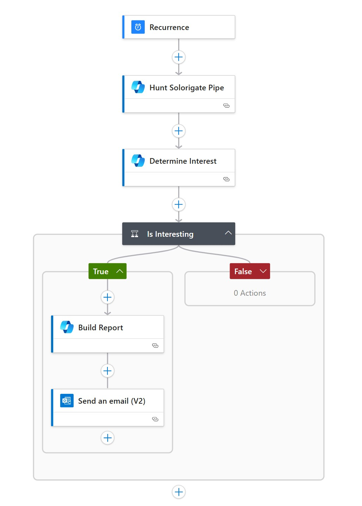

# AgentHunt

AgentHunt is a collection of purpose-built Security Copilot plugin skills designed to enhance hunting, detection, and investigation workflows in Microsoft Sentinel using Microsoft Defender XDR (formerly Microsoft 365 Defender) data.

## 🔍 Purpose

AgentHunt helps security teams identify, track, and respond to malicious email activity across an organization by leveraging a curated library of Kusto Query Language (KQL) queries packaged as Sentinel-compatible YAML-based skills.

In addition, AgentHunt provides an **automation layer with Azure Logic Apps** to run these hunting skills automatically on a set cadence and deliver findings to defenders via email. This ensures that key hunts are continuously executed without requiring manual intervention.

## 📦 Structure

Each skill is defined in a modular YAML format with the following fields:

- `Name`: Unique internal identifier  
- `DisplayName`: User-friendly title  
- `Description`: Overview of the detection/hunting scenario  
- `Settings`: Deployment settings including tenant, subscription, workspace, and the KQL `Template`

## ⚙️ Logic App Automation

The Logic App implementation enables automated execution of AgentHunt skills with the following flow:

1. **Recurrence Trigger** — Runs the workflow on a weekly schedule (configurable).  
2. **Run Hunt** — Executes a Security Copilot skill (e.g., Solorigate pipe detection).  
3. **Determine Interest** — Uses Copilot reasoning to decide if results are actionable.  
4. **Conditional Check** — If results are not interesting, the workflow ends. If they are interesting:  
   - **Build Report** — Summarizes findings into a concise HTML report.  
   - **Send Email** — Delivers the report to a configured notification email address.

This enables a “hunt → triage → report” loop without requiring human initiation.

### Workflow Diagram

## 📁 Directory Layout

AgentHunt/  
├── skills/ # All plugin YAML skill definitions  
│ ├── AgentHuntTopMaliciousURLDomains.yaml  
│ ├── AgentHuntTop10PercentAttackedUsers.yaml  
│ ├── AgentHuntZeroDayThreats.yaml  
│ └── ...more  
├── LogicApp/ # Automation to run hunts on a schedule  
│ ├── template.json  
│ ├── agentLogicApp.jpg  
│ └── README.md  
├── README.md # Project overview  
└── requirements.txt # (Optional) for automation or tooling  

## 🚀 Getting Started

To deploy a skill:

1. Replace the placeholder values in the `Settings` block:  
   - `<YOUR_TENANT_ID>`  
   - `<YOUR_SUBSCRIPTION_ID>`  
   - `<YOUR_RESOURCE_GROUP_NAME>`  
   - `<YOUR_WORKSPACE_NAME>`  

2. Import the skill into your Security Copilot plugin setup.

3. Use the skill in natural language within Security Copilot:

> "Show me the top 10 malicious URL domains from the last 30 days."

To enable **automated cadence-based hunting**, deploy the Logic App under `LogicApp/template.json` and configure the `notificationEmail` parameter.

## 📌 Requirements

- Microsoft Sentinel  
- Defender for Office 365 with email telemetry  
- Security Copilot with plugin support  
- Azure Log Analytics Workspace  
- (Optional) Azure Logic Apps for automation  

## 🛡 Use Cases

- Identify top malicious email senders  
- Track users who clicked phishing URLs  
- Detect spoofing attempts with failed authentication  
- Monitor policy-based overrides (admin/user)  
- Spot targeted users or campaigns  
- **Run scheduled hunts with automated reporting via Logic App**

## 📫 Feedback

Contributions or suggestions? Open an issue or reach out via GitHub.

© 2025 Robert Moriarty — Built for real-world defenders.
